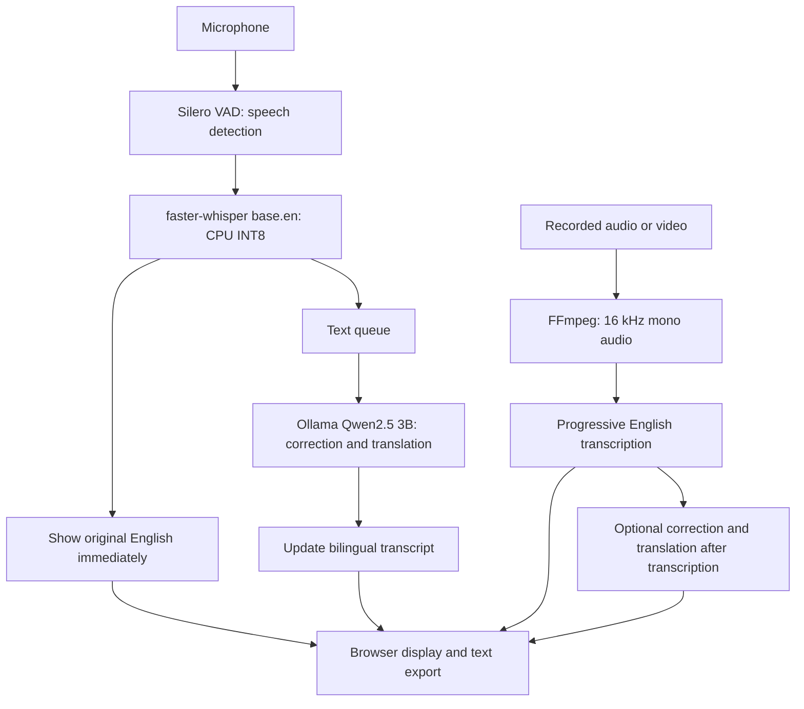

# Classroom Live

A local classroom transcription and translation application for ADI205/501. It shows English speech as text first, then adds corrected English and Chinese or Vietnamese translation. It also supports recorded audio/video, transcription-only mode for recordings, and `.txt` export.

Audio and text are processed locally using faster-whisper and Ollama. Initial setup requires internet access to download packages and models; no cloud API key is required.

## Demos

- [Live transcription and translation](demo/Demo_live_trans_new.mp4)
- [Recorded-media transcription and translation](demo/Recorded_transcription_demo.mp4)
- [Sample exported transcript](demo/live-transcript-2026-09-13.txt)

## Architecture



FastAPI serves the HTML/CSS/JavaScript interface. Live results arrive through WebSockets; recording results use streamed HTTP responses. Separate workers let live English appear while translation is still processing.

## Running the application

The following commands use **Windows PowerShell and a standard Python virtual environment**.

### 1. Install prerequisites

- A compatible 64-bit Python installation, available as `python` in your terminal.
- [Ollama](https://ollama.com/download) for local correction and translation.
- [FFmpeg](https://ffmpeg.org/download.html), available as `ffmpeg` in your terminal, for recorded-media conversion.
- A microphone for live transcription. Enable microphone access for desktop applications in Windows privacy settings.

### 2. Set up Python and the language model

Open PowerShell in the project folder and run:

```powershell
python -m venv .venv
.\.venv\Scripts\python.exe -m pip install --upgrade pip
.\.venv\Scripts\python.exe -m pip install -r requirements.txt
ffmpeg -version
ollama pull qwen2.5:3b
```

Keep Ollama running at `http://localhost:11434`. If the Ollama desktop application is not already serving it, run `ollama serve` in a separate terminal.

Or, simply click on run_venv for Windows.

### 3. Start the application

```powershell
.\.venv\Scripts\python.exe main.py
```

Wait for initialization, then open **http://localhost:8000**. The first startup may download the Whisper `base.en` model.

- **Live:** Select a microphone and target language, then start listening. English appears first; correction and translation follow.
- **Recording:** Choose a file and transcription mode, then press Start. Translation mode also offers language and passage-length settings.
- **Export:** Save results as `.txt` before clearing or reloading the page. Stopping a recording job preserves partial results but may wait for the current model operation to finish.

If translation fails, check that Ollama is running and `ollama list` includes `qwen2.5:3b`. If an upload fails, check FFmpeg and that the file contains audio. If no speech is detected, check the selected microphone and Windows permissions.

Translation speed depends on the computer. Informal Surface Pro 9 observations were approximately 2–3 seconds from speech to English and 7–8 seconds to corrected translation; these are estimates, not guaranteed timings.

See the [project report](docs/report.md) for design decisions and results, and [testing instructions](tests/README.md) for regression checks.
