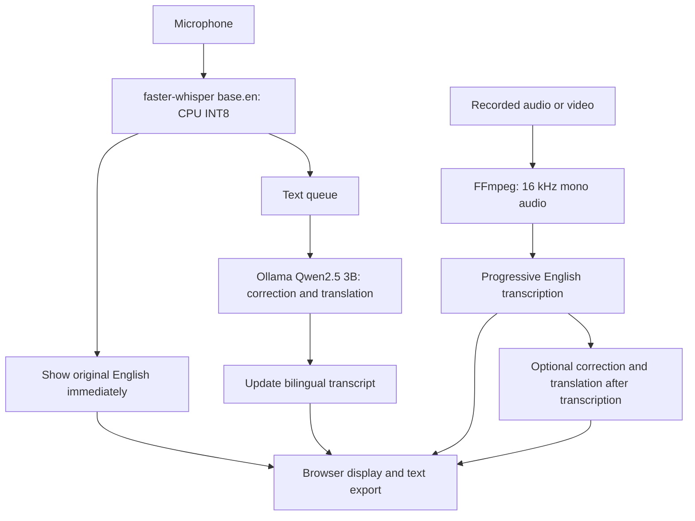

# Classroom Live

A local classroom transcription and translation application for ADI205/501. It shows English speech as text first, then adds corrected English and Chinese or Vietnamese translation. It also supports recorded audio/video, transcription-only mode for recordings, and `.txt` export.

Audio and text are processed locally using faster-whisper and Ollama. Docker installation requires internet access to download the image and models; no cloud API key is required.

**Peer testers: install Docker Desktop and follow [SETUP.md](SETUP.md). Python,
Ollama, and FFmpeg are already included in the image, so you do not install them
separately.**

## Demos

- [GitHub Pages portfolio article](https://jerrychan54321-coder.github.io/live-transcription-group-project/)

- [Live transcription and translation](demo/Demo_live_trans_new.mp4)
- [Recorded-media transcription and translation](demo/Recorded_transcription_demo.mp4)
- [Sample exported transcript](demo/live-transcript-2026-09-13.txt)

## Peer feedback and submission status

Read the [three peer comments and trial limitations](docs/peer-feedback.md).
The [original peer evidence document](Peer%20Usage%20Comments.docx), including its
screenshots, is included in this review branch. Peer 3 describes observing a demonstration,
so this is not evidence of three completed independent installation trials.
Jerry confirmed consent for public GitHub sharing of all content in that document,
including comments, screenshots, and identifying details.

The [requirements check](docs/submission-checklist.md) records completed work,
missing evidence, and the remaining submission tasks.

## Architecture



FastAPI serves the HTML/CSS/JavaScript interface. Live results arrive through WebSockets; recording results use streamed HTTP responses. Separate workers let live English appear while translation is still processing.

## Running the application

### Docker Desktop (peer installation)

The container version captures the microphone in your browser and includes Ollama,
FFmpeg, and the Python runtime. No host Ollama or API key is needed.
See [SETUP.md](SETUP.md) for the GUI installation path and
[docker/README.md](docker/README.md) for building the image locally.
Release image: **`jchan314/classroom-live:1.0.0`**, available on
[Docker Hub](https://hub.docker.com/r/jchan314/classroom-live).
This release targets Linux AMD64; Apple Silicon/ARM has not been verified.
The local development image remains `classroom-live:dev`.
First launch downloads model files automatically and displays setup progress.
See [Docker validation](docs/docker-validation.md) for completed checks and remaining
assignment work.

## Developer setup (running source code without Docker)

Peer testers should use [SETUP.md](SETUP.md). The optional instructions below are
for developers who want to run the source code directly on their computer.

<details>
<summary>Show developer prerequisites and terminal commands</summary>

The instructions below remain available for running directly in Python. That mode
uses the host microphone by default; set `AUDIO_SOURCE=browser` to use browser capture.

The following commands use **Windows PowerShell and a standard Python virtual environment**.

### 1. Install prerequisites

- A compatible 64-bit Python installation, available as `python` in your terminal.
- [Ollama](https://ollama.com/download) for local correction and translation.
- [FFmpeg](https://ffmpeg.org/download.html), available as `ffmpeg` in your terminal, for recorded-media conversion.
- A microphone for live transcription. Enable microphone access for desktop applications in Windows privacy settings.

### 2. Set up Python and the language model

Open PowerShell in the project folder and run:

```
python -m venv .venv
.\.venv\Scripts\python.exe -m pip install --upgrade pip
.\.venv\Scripts\python.exe -m pip install -r requirements.txt
ffmpeg -version
ollama pull qwen2.5:3b
```

Keep Ollama running at `http://localhost:11434`. If the Ollama desktop application is not already serving it, run `ollama serve` in a separate terminal.

#### Simple way for Windows
After completing prerequisites, double-click run_venv.bat to start the application.

### 3. Start the application

```powershell
.\.venv\Scripts\python.exe main.py
```

Wait for initialization, then open **http://localhost:8000**. The first startup may download the Whisper `base.en` model.

- **Live:** Select a microphone and target language, then start listening. English appears first; correction and translation follow.
- **Recording:** Choose a file and transcription mode, then press Start. Translation mode also offers language and passage-length settings.
- **Export:** Save results as `.txt` before clearing or reloading the page. Stopping a recording job preserves partial results but may wait for the current model operation to finish.

If translation fails, check that Ollama is running and `ollama list` includes `qwen2.5:3b`. If an upload fails, check FFmpeg and that the file contains audio. If no speech is detected, check the selected microphone and Windows permissions.

</details>

Translation speed depends on the computer. Informal Surface Pro 9 observations were approximately 2–3 seconds from speech to English and 7–8 seconds to corrected translation; these are estimates, not guaranteed timings.

See the [project report](docs/report.md) for design decisions and results, and [testing instructions](tests/README.md) for regression checks.

## Team credits

- **Jerry Chan:** Implemented transcription, the initial webpage, and Ollama correction and translation; led Docker packaging and Docker Hub publication.
- **Owen Liu:** Compiled the technical decisions and their justification for the project report.
- **Yiyang Ge:** Updated the interface, extended recorded-media transcription, and changed live output to show English before correction and translation.
- **Quang:** Proposed Vietnamese translation support and helped select and test the Ollama model.

## License

This project's original code is licensed under the [MIT License](LICENSE).
Third-party software and models retain their respective licenses.
