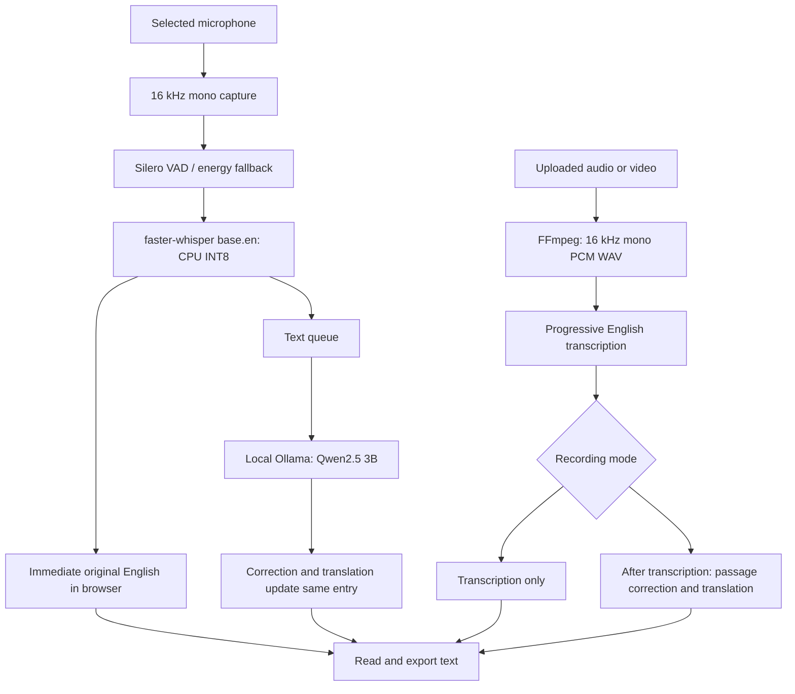
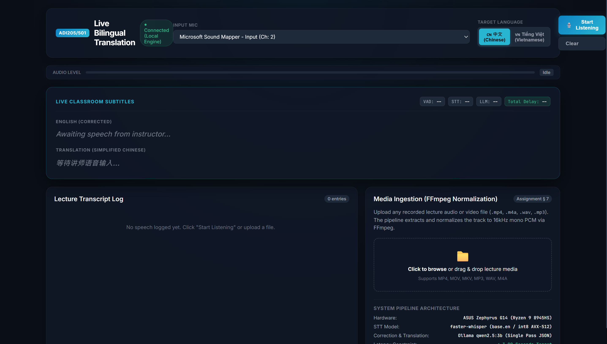
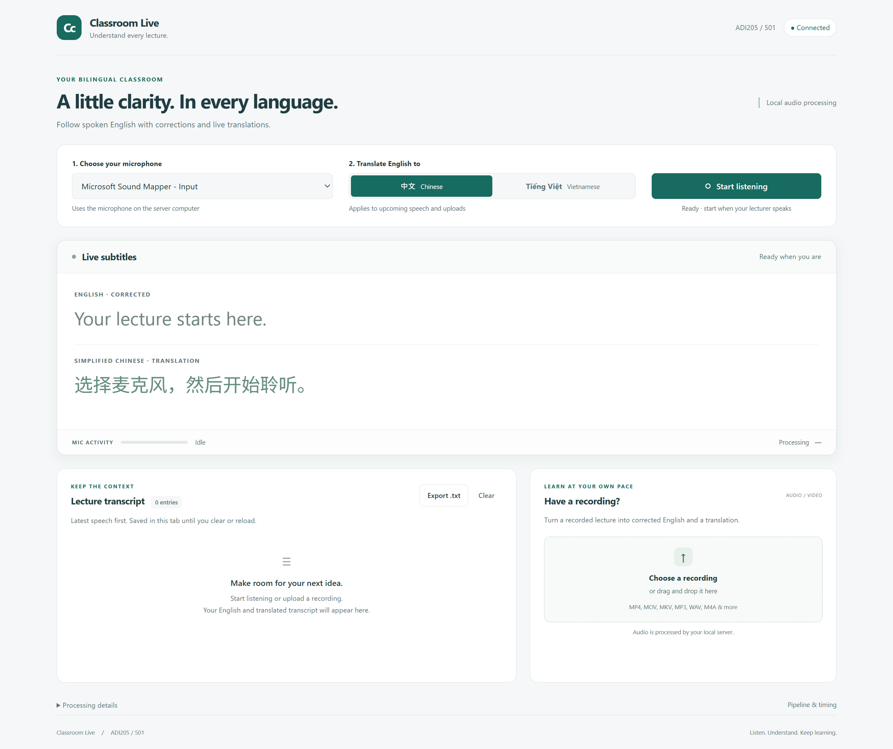
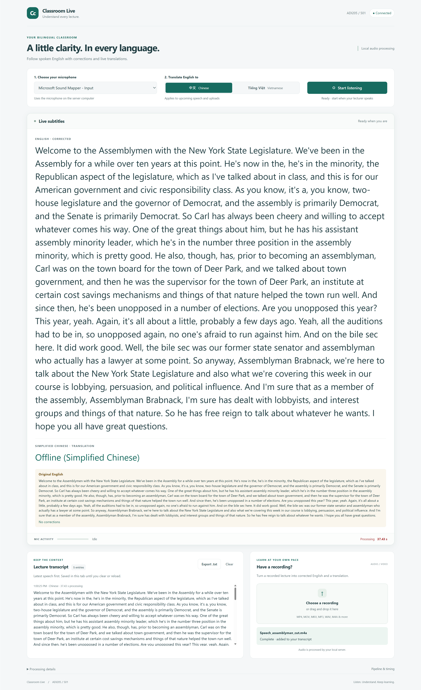
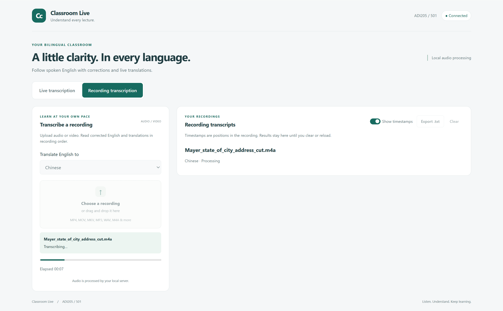
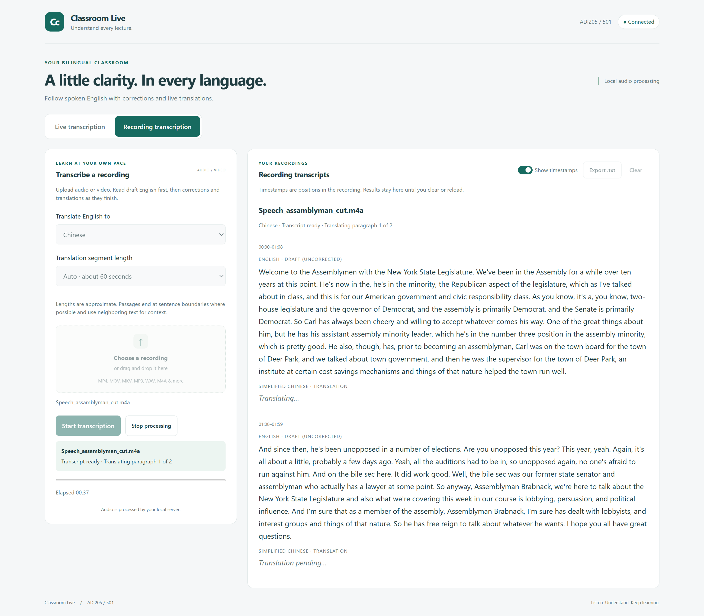

# Classroom Live: Live Bilingual Classroom Translation

**ADI205/501 — AI Augmented Professional Practice**\
**Status:** Development report based on the current source code, team observations, and recorded demonstrations. The final live classroom demonstration is pending.

## 1. Objective and team

Classroom Live helps students follow English lectures by displaying original English transcription, corrected English, and a Chinese or Vietnamese translation. It also processes recorded audio/video and exports text for later review. Privacy and affordability guided the design: audio and text inference run locally rather than being sent to an external API. Initial software and model downloads require internet access; local processing avoids per-use API fees but still uses the computer's resources.

| Member | Contribution |
|------------------------------------|------------------------------------|
| Jerry Chan | Implemented core functionality: transcription, the basic webpage, and Ollama correction and translation. |
| Owen Liu | Compiled the technical decisions and their justification. |
| Yiyang Ge | Updated the UI, extended recorded transcription, and changed live output to display English before correction and translation. |
| Quang | Contribution to be confirmed. |

The assignment requires live microphone input, incremental bilingual output, correction, engineering comparisons, testing evidence, and approximately three seconds or less of end-to-end delay. The prototype provides the main workflows, but the full corrected translation does not meet that timing target in the reported observations.

## 2. Architecture and operation



FastAPI serves the browser interface and coordinates the pipeline. Live speech recognition and correction/translation run in separate workers. Recognized English is published through WebSockets immediately after recognition; the slower model updates the corresponding transcript entry later. Original English remains available, and corrected English is shown when it differs. The live English panel joins chunks into growing sentences, using approximate punctuation boundaries.

Recorded media has its own workspace, settings, results, and exports. FFmpeg extracts and normalizes audio before recognition. English appears progressively through streamed HTTP responses. In translation mode, the application completes recognition before translating grouped passages with neighboring context. Users can select approximate passage lengths, stop processing, and retain partial results. Transcription-only mode skips correction and translation. Stop is cooperative: an operation already running may finish before cancellation is acknowledged.

## 3. Engineering decisions

The group used Perplexity-assisted research to investigate alternatives. The supplied research export discusses Whisper implementations and cloud transcription services. These were researched options, not a controlled benchmark of every alternative.

| Stage | Selected implementation and rationale | Alternatives and tradeoffs |
|------------------------|------------------------|------------------------|
| Audio capture | `sounddevice` with user selection from detected input devices. The built-in microphone avoids extra equipment and suits a portable prototype. | USB, wireless/lapel, and virtual inputs can be used if detected. External microphones may improve distant speech capture but add cost and setup; they were not evaluated here. |
| Noise handling | No dedicated noise-removal filter. Silero VAD identifies speech, with an RMS-energy fallback if unavailable. This keeps the initial pipeline simple. | Noise gates, RNNoise, and device/OS suppression were considered. They require tuning or additional integration and may affect quiet speech. VAD is speech detection, not noise removal; noisy-classroom testing remains pending. |
| Transcription | Local `faster-whisper`, using English `base.en` with CPU INT8 and six configured CPU threads. It integrates directly into Python and limits model size and computing demand. | Original Whisper, whisper.cpp, larger Whisper models, cloud APIs, and OS/meeting transcription were considered. The group favored Python integration and local control; larger or cloud models would need separate accuracy, latency, and resource evaluation. |
| Correction | Qwen2.5 3B through local Ollama corrects English in the same request that translates it. Python compares original and corrected words for display. | Rule-based correction is simpler but less contextual. A cloud language model introduces external text processing and possible charges. The local model can still miss errors or change meaning. |
| Translation | Reuse Qwen2.5 3B for Chinese or Vietnamese, reducing the number of models and integration steps. | A separate local translation model or cloud service could be evaluated for quality and speed. The current joint correction/translation call is the main observed bottleneck. |
| UI | HTML, CSS, and JavaScript with FastAPI/Uvicorn; WebSockets deliver live updates. A browser interface fits the existing Python backend and supports flexible layouts. | A Python desktop GUI adds a different UI framework; native macOS development would not suit the Windows demo device. Browser rendering does not eliminate inference delay. |
| Media formats | Direct FFmpeg conversion to 16 kHz mono, 16-bit PCM WAV, then NumPy float32 samples for recognition. This gives explicit control over normalization. | Pydub adds a wrapper; direct faster-whisper decoding could simplify the pipeline; WAV-only input burdens users; cloud conversion sends recordings outside the computer. |

The faster-whisper documentation publishes implementation benchmarks and supports CPU INT8, but its results are not measurements of this project or Surface Pro 9. [Faster-whisper documentation](https://github.com/SYSTRAN/faster-whisper).

Groq Whisper Large v3 was a researched cloud transcription alternative. Its documentation lists usage pricing and upload limits, illustrating the constraints the group wanted to avoid. It is not the model used for Chinese/Vietnamese correction and translation. [Groq model documentation](https://console.groq.com/docs/model/whisper-large-v3).

### Tools and versions

The repository specifies the following **minimum package versions**, not a verified record of the demo environment:

| Packages                                   | Declared minimum versions |
|--------------------------------------------|---------------------------|
| FastAPI / Uvicorn / websockets             | 0.110.0 / 0.28.0 / 12.0   |
| sounddevice / NumPy                        | 0.4.6 / 1.26.0            |
| faster-whisper / ONNX Runtime / silero-vad | 1.0.0 / 1.17.0 / 5.1      |
| requests / python-multipart                | 2.31.0 / 0.0.9            |

Configured model identifiers are `base.en` and `qwen2.5:3b`. Exact installed Python, package, FFmpeg, and Ollama versions were not recorded in the supplied demo evidence and should be captured before submission.

## 4. Development and UI improvements

Speed was the largest development problem. The team observed that Ollama correction and translation took substantially longer than English recognition. Publishing English first gave users useful feedback sooner, while preserving later correction and translation. This improved perceived responsiveness without establishing a reduction in final translation latency.

The interface also evolved from a shared live/recorded display to separate workspaces. Earlier recordings could fill the live subtitle area with a long block of text. Separate recording results, paragraph grouping, timestamps, explicit controls, and progress made this workflow easier to follow.

The following screenshots document development stages, not a complete view of the latest live layout. Their displayed processing counters are not validated end-to-end timing measurements.



*Figure 1. Original dark interface before the UI redesign. The hardware label belongs to that earlier interface; the reported demo device was a Surface Pro 9.*



*Figure 2. Initial redesign with clearer microphone/language controls, larger text, and transcript export.*



*Figure 3. Earlier problem: recorded text occupied the live subtitle area without paragraph separation. Translation was unavailable in this historical example.*



*Figure 4. A dedicated recording workspace separates uploaded-media processing from live transcription.*



*Figure 5. Later recording workflow adds passage-length selection, Start/Stop controls, timestamps, and English output while translation remains pending. This is the sixth supplied screenshot; the fifth supplied screenshot is intentionally excluded.*

## 5. Testing and results

### Environment and procedure

The recorded demonstration ran on a **Surface Pro 9, Windows 11, Intel Core i7-1255U (2.60 GHz), 16 GB RAM, and Intel Iris Xe integrated graphics**. It used the built-in microphone in a quiet environment. The team observed live English and translation output, reviewed exported text, and tested recorded-media formats. The final live demonstration and realistic classroom-noise testing have not yet been completed.

| Check | Reported result | Evidence boundary |
|------------------------|------------------------|------------------------|
| Speech to original English | Approximately 2–3 seconds | Informal estimate from speaking, not instrumented statistics. |
| Speech to corrected translation | Approximately 7–8 seconds total | Informal estimate from speaking, not an additional 7–8 seconds after English. Exceeds the assignment target. |
| Recorded formats | MKV, MOV, MP4, FLAC, WAV, MP3, M4A | No failures reported in tested transcription, translation, and export; does not establish compatibility with every codec/file. |
| Target languages | Mostly Chinese; Vietnamese tried once | Vietnamese quality has not been thoroughly evaluated. |
| Recognition and translation quality | Clearer spoken English generally produced better results | Qualitative observation; no reference transcript or numerical accuracy score. |
| Classroom noise | Not yet evaluated. Can be avoided with wireless microphone. | Quiet-environment results cannot establish classroom performance. |

The code's displayed latency adds recognition time, model time, and a fixed 10 ms. It omits audio accumulation and queue/display delays, so it cannot verify the full speech-to-display target. Current live VAD permits chunks up to 4.5 seconds, further limiting any universal sub-three-second claim.

### Accuracy example

The updated live demonstration is accompanied by this exported example:

| Session timestamp | Original English | Corrected English | Chinese translation |
|------------------|------------------|------------------|------------------|
| 00:12 | transform your life. | transform your life. | 改变你的生活。 |
| 00:16 | Success is something you attract by the person you become. | Success is something you attract by the person you become. | 成功是你成为的人吸引来的。 |
| 00:18 | Jim Rohn. | Jim Rohn. | Jim Rohn. |

This sample provides a clearer example of useful output: the first translation is natural, the second conveys the main idea but is somewhat literal, and the proper name is preserved in English. These are qualitative observations rather than a numerical accuracy assessment. The timestamps indicate session positions, not processing delays.

All three excerpts have identical original and corrected English, with no corrections listed.

### Regression checks and evidence

The repository contains Python tests for streaming, cancellation, error handling, and live publication, plus browser checks for workspace isolation, progress, exports, layout, and safe text rendering. Development history reports passing checks, but these use simulated inference and are not proof of real-model accuracy or microphone performance. They were not rerun while writing this report.

Evidence included in the project:

- [Updated live demonstration video](../demo/Demo_live_trans_new.mp4)
- [Recorded-media demonstration video](../demo/Recorded_transcription_demo.mp4)
- [Updated exported live transcript](../demo/live-transcript-2026-09-13.txt)
- [Regression-test instructions and scope](../tests/README.md)
- Development screenshots in Section 4.

## 6. Running the application

These instructions use a standard Python virtual environment on Windows; Conda is not required. Install a compatible 64-bit Python distribution, [Ollama](https://ollama.com/download), and [FFmpeg](https://ffmpeg.org/download.html). Make `python`, `ollama`, and `ffmpeg` available in the terminal. FFmpeg is required by this application's recording conversion step.

From the project root in PowerShell:

``` powershell
python -m venv .venv
.\.venv\Scripts\python.exe -m pip install --upgrade pip
.\.venv\Scripts\python.exe -m pip install -r requirements.txt
ffmpeg -version
ollama pull qwen2.5:3b
```

Ensure Ollama is running at `http://localhost:11434`. If its desktop application is not serving it, run `ollama serve` in a separate terminal. Then launch:

``` powershell
.\.venv\Scripts\python.exe main.py
```

Open **http://localhost:8000** after initialization finishes. First startup may download the Whisper model. No external API key is required. In Windows microphone privacy settings, allow microphone access for desktop applications. The Python server captures the microphone on its own computer.

For live use, select the microphone and target language, then start listening. Read English as it appears and the correction/translation when available; stop listening and export the transcript as needed. For recordings, choose the recording tab, select a mode and file, adjust translation settings if applicable, and press Start. Stop preserves partial results; export before clearing or reloading the page.

If there is no input, check microphone selection and permissions. If translation fails, check Ollama and confirm `qwen2.5:3b` appears in `ollama list`. If recording conversion fails, check FFmpeg and whether the file contains a decodable audio track. Restart the server and refresh the browser after code changes.

To run backend checks, install the API test dependency and use:

``` powershell
.\.venv\Scripts\python.exe -m pip install httpx
.\.venv\Scripts\python.exe -m unittest discover -s tests -v
```

Browser checks additionally require Node.js, Playwright, and Microsoft Edge; see the linked testing instructions. Capture the actual environment for reproducibility with `python --version`, the environment's `python -m pip freeze`, `ffmpeg -version`, and `ollama --version`.

## 7. Limitations and next steps

The principal limitation is the 7–8-second observed corrected-translation delay. English-first output helps users follow speech, but does not satisfy the full bilingual timing requirement. Secondly, sentence splitting can remove context.

Next steps are to develop a mechanism that well handles context preservation during live transcription instead of only in recorded transcription. An optional paid cloud correction/translation service could be compared with local inference for speed and quality. Any benefit must be weighed against charges, internet dependence, and sending text outside the computer.

The prototype establishes a local live and recorded transcription workflow. Its main engineering improvement is separating immediate English feedback from slower correction and translation. Current evidence supports functional progress and identifies concrete accuracy and latency limitations that largely depends on the hardware given it is all local based and tested demo is not on a strong computer.

## References

1.  Zheng Qu, *ADI205/501 Group Project: Live Bilingual Classroom Translation Application*, August 27, 2026. Assignment PDF supplied with the repository.
2.  Team technical-decision notes and interview responses supplied by Yiyang Ge.
3.  Perplexity research export, *any good and free model for transcription*, supplied by the team. Used as evidence of alternatives researched, not a project benchmark.
4.  [SYSTRAN: faster-whisper](https://github.com/SYSTRAN/faster-whisper).
5.  [Ollama: Qwen2.5 3B](https://ollama.com/library/qwen2.5:3b).
6.  [Silero VAD documentation](https://github.com/snakers4/silero-vad).
7.  [FFmpeg documentation](https://ffmpeg.org/ffmpeg.html).
8.  [Groq: Whisper Large v3](https://console.groq.com/docs/model/whisper-large-v3).

Official web references checked during report preparation in September 2026. Vendor claims are not substituted for project measurements.